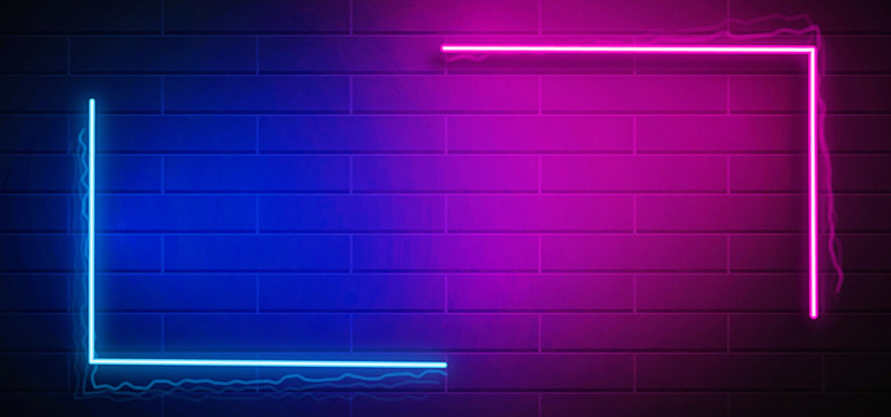

# Tetris v7

[](https://godoc.org/github.com/jeffotoni/tetris) [](https://goreportcard.com/report/github.com/jeffotoni/tetris) [](https://github.com/jeffotoni/tetris/blob/main/LICENSE)    

A classic Tetris game built with **Go** and **Ebitengine**, runnable on desktop and in the browser through **WebAssembly**.

This repository keeps only the final, clean version of the project while preserving the development journey as context.

---

## About

Tetris v7 focuses on the core gameplay loop:

- Piece falling and movement
- Rotation and collision checks
- Row clear and score progression
- Game Over state with restart
- Embedded textures, fonts, and sounds
- Desktop and browser execution

---

## Tetris in Action



> You can replace this preview with a gameplay image or GIF later.

---

## Requirements

- Go 1.22 or newer
- A modern browser with WebAssembly support for the web version

---

## Quick Start

```bash
git clone https://github.com/jeffotoni/tetris.git
cd tetris
go run .
```

---

## Controls

| Action | Key |
|---|---|
| Move left | Arrow Left |
| Move right | Arrow Right |
| Soft drop | Arrow Down |
| Rotate | Space |
| Restart after Game Over | R |

---

## Run on Desktop

```bash
go run .
```

Build a local binary:

```bash
go build -o tetris .
./tetris
```

---

## Run in the Browser with WebAssembly

### Option A: Build with Go and serve static files

```bash
GOOS=js GOARCH=wasm go build -o web/tetris.wasm .
cd web
python3 -m http.server 8080
```

Open:

```text
http://localhost:8080
```

### Option B: Use wasmserve

```bash
go run github.com/hajimehoshi/wasmserve@latest .
```

Open:

```text
http://localhost:8080/web/
```

Important:

- Run `wasmserve` from the project root.
- Do not run `wasmserve ./web`, because `web/` does not contain the Go entrypoint.
- `web/index.html` can load both `tetris.wasm` and `/main.wasm`, so it works with both options above.

---

## Browser Audio

Browsers can block game audio until the page receives user interaction.

If the game starts without sound:

- Click the game page or canvas once.
- Press any key.
- The message `Audio locked by browser...` disappears when audio is ready.

---

## Desktop Audio (macOS)

On macOS, audio is disabled by default to avoid CoreAudio startup failures in some environments.

To force-enable audio:

```bash
TETRIS_AUDIO=1 go run .
```

---

## Project Layout

```text
.
├── assets/
│   ├── PressStart2P-Regular.ttf
│   ├── background.png
│   ├── gameover.wav
│   ├── striker-2.ttf
│   └── tetris-piano.mp3
├── web/
│   ├── index.html
│   └── wasm_exec.js
├── main.go
├── go.mod
├── go.sum
├── README.md
└── LICENSE
```

---

## Troubleshooting

### `expected magic word ... found 34 30 34 20`

This means the browser received a `404` HTML response instead of a real `.wasm` file.

Fixes:

- With Option A, make sure `web/tetris.wasm` exists after running the build command.
- With Option B, run `go run github.com/hajimehoshi/wasmserve@latest .` from the project root and open `/web/`.

### No sound in the browser

This is usually caused by browser autoplay policy.

Fix:

- Click the page and press a key once to unlock audio.

---

## Development Journey

| Version | Focus |
|---|---|
| Version 0 | Basic board and falling block rendering |
| Version 1 | Piece movement controls |
| Version 2 | Collision checks |
| Version 3 | Rotation behavior |
| Version 4 | Scoring and row clear rules |
| Version 5 | Textures and visual polish |
| Version 6 | Sound and game over flow |
| Version 7 | Current clean version with desktop and web structure |

---

## Contributing

Contributions are welcome.

Suggested ways to improve the project:

- Add automated tests for collision and row clear logic.
- Improve mobile touch controls.
- Add new visual themes and sound options.
- Open an issue with ideas or bugs.

---

## License

This project is open source under the **MIT License**.

Copyright (c) 2026 Jefferson Otoni Lima.

See [LICENSE](./LICENSE) for the full license text.
